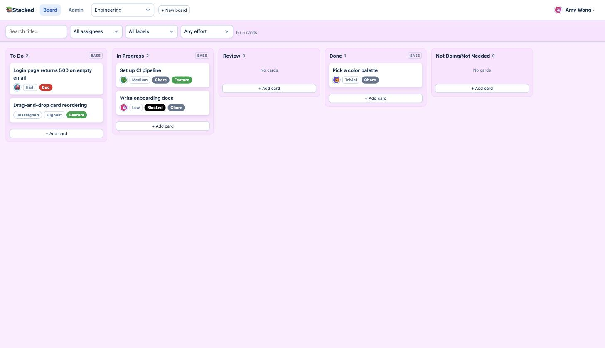
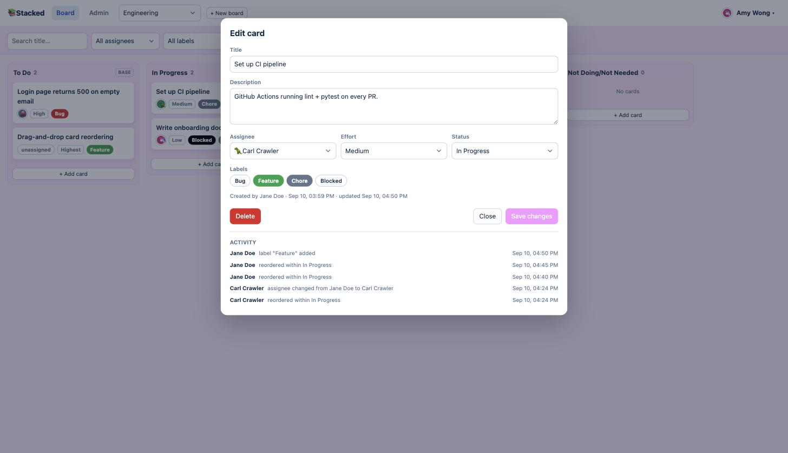
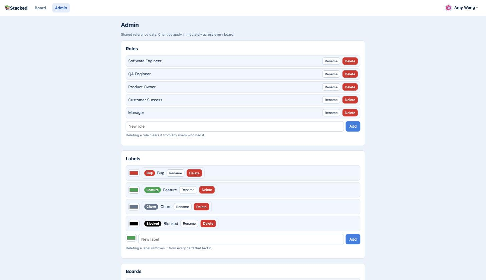

# Stacked

A lightweight, internal Kanban board for tracking tasks across a small team.

Stacked lets people capture work as cards and move them through a configurable
workflow (To Do → In Progress → Done, plus any custom stages you add). It is
built for a small, trusted group: there are no passwords and no permission tiers.
You identify yourself once with a name, email, role, color, and emoji, and that
profile is reused to tag the cards you create and the work you're assigned.

See [`_docs/specs.md`](_docs/specs.md) for the full product spec.

## Screenshots

### Board view

Columns for each workflow stage, cards tagged with assignee, effort, and labels,
quick-add from any column, and a filter/search bar.



### Card view

Full card editor — title, description, assignee, effort, status, labels,
delete-with-confirm, and the auto-generated, read-only activity log.



### Admin section

CRUD for roles, labels, boards, statuses, and effort levels, plus user
active/inactive. Deletions of roles, labels, and effort levels cascade.



## Highlights

- **Multiple boards** for different projects or teams. Boards are never deleted,
  only archived (and unarchived) from the Admin page.
- **Identification, not authentication.** First-time users create a profile;
  returning users on the same device are recognized automatically. A one-click
  "switch identity" action covers shared devices.
- **Recognizable identities.** Every user picks a hex color and an emoji, shown
  as a badge on the cards they own so you can scan a board at a glance.
- **Configurable reference data.** Roles, labels, card statuses, effort levels,
  and boards are all managed from the Admin page — no code changes needed.
- **Card details.** Title, description, assignee, creator, multiple labels,
  effort level (Low / Medium / High / Highest), position, and an auto-generated,
  read-only activity log.
- **Board interaction.** Quick-add cards from any column, drag-and-drop to move
  and reorder (with a "move to" dropdown fallback), and filter or search by
  assignee, label, effort, or card title.

## Core concepts

| Entity | Notes |
|---|---|
| **Board** | Has a name and its own cards. Archive-only, never deleted. |
| **Status (Column)** | Workflow stage, shared globally across all boards. To Do, In Progress, and Done are locked; custom statuses can be added, renamed, reordered, and deleted. Deleting a custom status sends its cards back to To Do. |
| **Card** | A ticket on a board. Only the title is required. |
| **Label** | Name + color, applied to any number of cards. Deleting a label removes it from every card that had it. |
| **Effort Level** | Low / Medium / High / Highest by default. Optional on a card; deleting one clears it from any cards using it. |
| **User** | Name, email (unique), role, color, emoji, and an admin-controlled active/inactive flag. Inactive users are hidden from assignee pickers but keep their history. |
| **Activity Log Entry** | Auto-generated record of a change to a card (what, who, when). Read-only. |

## Admin page

Open to all users. Provides CRUD for roles, labels, card statuses, effort
levels, and boards, plus marking users active/inactive. Deletions of roles,
labels, and effort levels cascade — the value is cleared from any records that
referenced it.

Archiving a board requires typing the board's exact name to confirm. Once
archived, the board and all of its cards disappear from normal views and become
fully read-only until an admin unarchives it.

## Out of scope for v1

Real authentication (passwords, SSO, OAuth), per-board access control,
notifications, time tracking and reporting dashboards, file attachments, due
dates and overdue indicators, and a native mobile app. Responsive web is
enough. These may be revisited later.

## Development

Requires [uv](https://docs.astral.sh/uv/).

```sh
uv sync            # install dependencies
uv run pytest      # run the test suite
```

### Conventions

- Dependencies are declared in `pyproject.toml`.
- Configuration comes from the environment. Every setting is an env var with a
  corresponding line in `.env.example` — no hardcoded values or checked-in
  secrets.
- Tests live in `tests/`. `config/settings_test.py` supplies their environment,
  so production settings stay strict.

## Success criteria for v1

- A new user can go from opening the app to a task created, assigned, and
  labeled in under a minute.
- Returning users never re-identify on the same device.
- An admin can adjust roles, labels, boards, statuses, and effort levels without
  developer involvement.
- A board accurately reflects current work at a glance — who's doing what, how
  much effort it is, and what it's tagged with.
